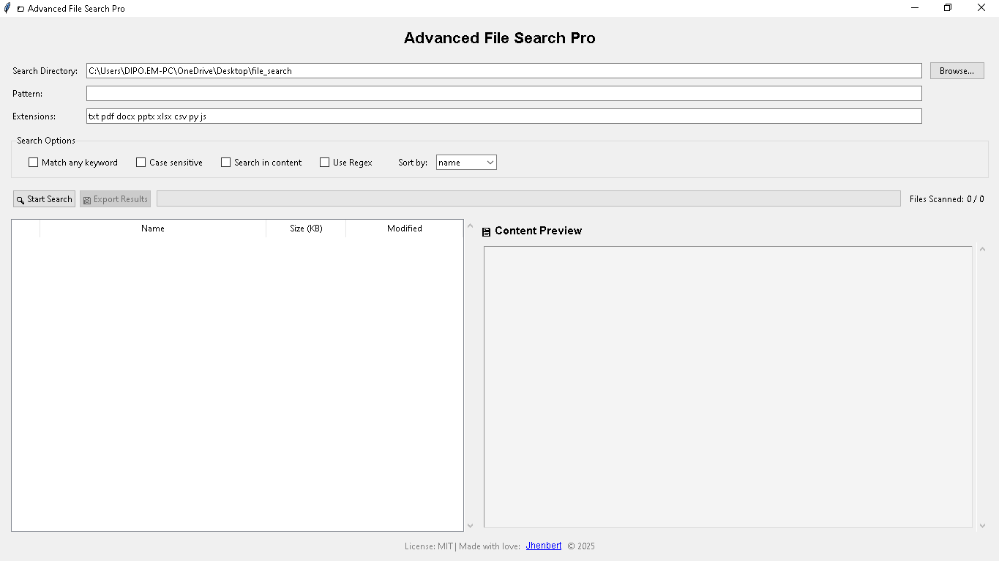

# 📁 Advanced File Search Pro

A desktop application for Windows, macOS, and Linux to perform advanced searches for files and within files. Built with Python and Tkinter.

This tool allows users to search for files by name, extension, and content, using simple text matching or powerful regular expressions.

## Screenshot



## ✨ Key Features

- **Search by Name or Pattern**: Find files using simple text or complex regex patterns.
- **Content Search**: Deep search within the content of various file types, including:
  - Plain Text (`.txt`)
  - PDF (`.pdf`)
  - Microsoft Word (`.docx`)
  - Microsoft PowerPoint (`.pptx`)
  - Microsoft Excel (`.xlsx`)
  - CSV (`.csv`)
- **Filter by Extension**: Narrow down your search to specific file types (e.g., `pdf`, `py`, `txt`).
- **Flexible Search Options**:
  - Case-sensitive or insensitive searching.
  - Match all keywords or any single keyword.
  - Toggle between plain text and regex mode.
- **Interactive Results**:
  - View results in a clear, sortable table.
  - Sort by name, modification date, or file size.
  - Open files or their containing folders directly from the app.
  - Copy file paths to the clipboard.
- **Content Preview**: See a preview of the file content with search terms highlighted.
- **Export Results**: Save your search results to a `.csv` or `.xlsx` file for further analysis.

---

## 🚀 Getting Started (For Users)

Follow these instructions to get the application running on your local machine.

### Prerequisites

- **Python 3.6+**: Ensure you have Python installed. You can download it from [python.org](https://www.python.org/downloads/).

### Installation

1.  **Clone the repository**:

    ```bash
    git clone https://github.com/apcemgit/file-search.git
    cd file-search
    ```

    (Or download the source code as a ZIP file and extract it.)

2.  **Install dependencies**:
    It's recommended to use a virtual environment.

    ```bash
    # Create and activate a virtual environment (optional but recommended)
    python -m venv venv
    source venv/bin/activate  # On Windows, use `venv\Scripts\activate`

    # Install the required packages
    pip install -r requirements.txt
    ```

### Running the Application

Once the dependencies are installed, you can start the application by running:

```bash
python run.py
```

### How to Use

1.  **Select a Directory**: Click "Browse..." to choose the folder you want to search in.
2.  **Enter a Pattern**: Type the text or regex pattern you are looking for.
3.  **Set Extensions**: Specify the file extensions to include in the search (e.g., `pdf docx`), or leave it blank to search all files.
4.  **Choose Options**: Select your desired search options (case sensitivity, content search, regex, etc.).
5.  **Start Search**: Click the "Start Search" button.
6.  **View Results**: The found files will appear in the results table. You can double-click a file to open it or right-click for more options.
7.  **Preview Content**: Click on a result to see a preview of its content in the right-hand pane.

---

## 👨‍💻 For Developers

This section provides technical details about the project structure and codebase for those who wish to contribute or modify the application.

### Project Structure

The project is organized into a modular package structure to separate concerns and improve maintainability:

```
file-search/
├── file_search_app/           # Main application package
│   ├── __init__.py
│   ├── config.py              # Stores static data like icon mappings
│   ├── file_reader.py         # Logic for reading content from different file types
│   ├── main.py                # Application entry point, initializes the UI
│   ├── search.py              # Core search engine, UI-independent
│   ├── ui.py                  # Main GUI class and all UI components
│   └── utils.py               # Utility classes and functions (e.g., Tooltip)
├── .gitignore
├── LICENSE
├── README.md
├── requirements.txt           # Project dependencies
└── run.py                     # Script to launch the application
```

### Code Overview

- **`run.py`**: The main entry point. It imports and calls the `main` function from the application package.
- **`file_search_app/main.py`**: Initializes the Tkinter root window and the `FileSearchApp` class.
- **`file_search_app/ui.py`**: Contains the `FileSearchApp` class, which is responsible for creating all widgets, handling user events, and orchestrating calls to the backend search logic. The search itself is run in a separate thread to keep the UI responsive.
- **`file_search_app/search.py`**: Implements the `FileSearcher` class. This class handles all file system traversal and pattern matching logic. It is completely decoupled from the UI and uses callbacks to report progress and results.
- **`file_search_app/file_reader.py`**: A module dedicated to extracting text content from various file formats. It isolates optional dependencies like `PyPDF2` and `pandas`.
- **`file_search_app/config.py` & `utils.py`**: These modules hold shared configurations and helper utilities to keep the main code clean.

### Dependencies

All required Python packages are listed in `requirements.txt`. Key dependencies include:

- `pandas`: For reading `.xlsx` files.
- `PyPDF2`: For reading `.pdf` files.
- `python-docx`: For reading `.docx` files.
- `python-pptx`: For reading `.pptx` files.
- `openpyxl`: Used for exporting results to `.xlsx` files.

---

## 📄 License

This project is licensed under the MIT License. See the [LICENSE](LICENSE) file for details.

## 🙏 Acknowledgements

- The original creator of this application is **Jhenbert** ([jhenbert.dev](https://jhenbert.dev)).
